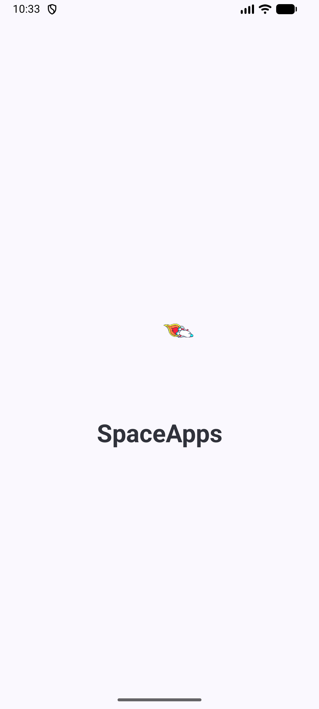
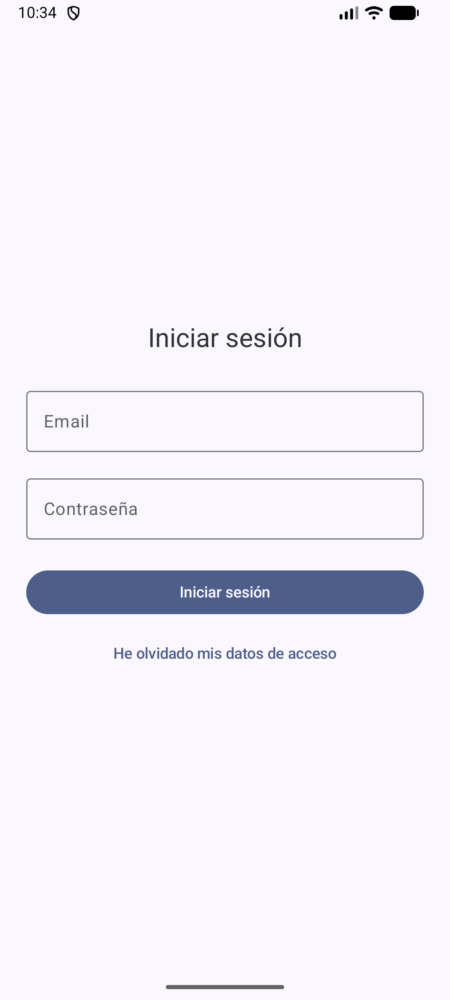
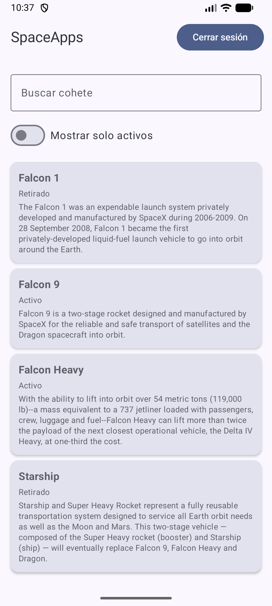
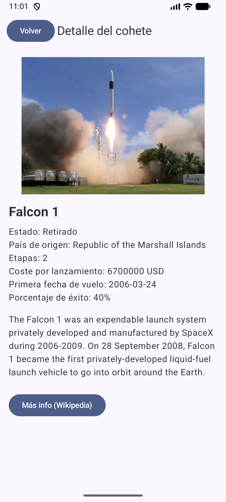

📱 Ficha simulada de Google Play – SpaceApps
🏷 Nombre de la app

SpaceApps – Cohetes SpaceX en tu bolsillo

✏ Descripción breve

Consulta los cohetes de SpaceX con detalles técnicos, filtrado por estado y acceso directo a Wikipedia.

📖 Descripción completa

SpaceApps es una aplicación Android desarrollada por Jovi Cucarella Montell como proyecto final del módulo M07.

La app permite consultar información real sobre los cohetes de SpaceX haciendo uso de su API pública, mostrando los datos en una interfaz moderna basada en Jetpack Compose y preparada para funcionar sin conexión gracias a Room.

✨ Funcionalidades principales

🛰 Pantalla Splash animada
Animación de un cohete al iniciar la aplicación.

🔐 Login validado
Formulario sencillo con credenciales académicas de práctica.

🚀 Lista de cohetes

Búsqueda por nombre

Filtro “Mostrar solo activos”

Carga de datos en tiempo real desde la API

Persistencia en local mediante Room

📄 Pantalla de detalle
Muestra imagen, detalles técnicos (etapas, primera fecha de vuelo, éxito, etc.) y enlace directo a Wikipedia.

🌐 Estados visuales de la UI

Cargando

Sin resultados

Error con botón “Reintentar”

Modo offline automático

♿ Accesibilidad
Todos los elementos relevantes cuentan con contentDescription, y los mensajes de error o estado están optimizados para tecnologías asistivas.

🧰 Tecnologías utilizadas

Kotlin, Jetpack Compose, Navigation, Retrofit,
Gson, Room, Coroutines, Coil, Material 3, MVVM

🎨 Icono de la aplicación

La app utiliza un icono ic_launcher personalizado, basado en un cohete en estilo flat.
Se han generado todas las resoluciones necesarias (mdpi → xxxhdpi), incluyendo su versión redonda (ic_launcher_round).

📸 Capturas de pantalla

🛰 Splash animado

  

🔐 Pantalla de login

  

🚀 Lista de cohetes

  

📄 Detalle del cohete

  

🔗 Código fuente
Repositorio oficial del proyecto:
👉 https://github.com/jovicumon/spaceapps-android

